<p><small>Best View in <a href="https://github.com/settings/appearance">Light Mode</a> and Desktop Site (Recommended)</small></p><br/>

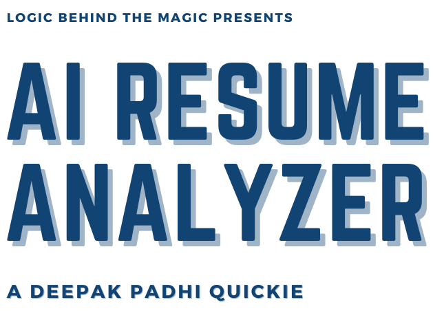

<div align="center">
  <h1>🌴 AI RESUME ANALYZER 🌴</h1>
  <p>A Tool for Resume Analysis, Predictions and Recommendations</p>
  <!-- Badges -->
  <p>
    
    
    
    
    <a href="https://github.com/engmaryamameen/AI-Resume-Analyzer/stargazers"></a>
    <a href="https://github.com/engmaryamameen/AI-Resume-Analyzer/watchers"></a>
    <a href="https://github.com/sponsors/engmaryamameen"></a>
    <a href="https://www.linkedin.com/in/maryam-ameen"></a>
    <a href="./LICENSE">
      
    </a>
  </p>
  
  <!--links-->
  <h4>
    <a href="#preview-">View Demo</a>
    <span> · </span>
    <a href="#setup--installation-">Installation</a>
    <span> · </span>
    <a href="mailto:dnoobnerd@gmail.com?subject=I%20Want%20The%20Project%20Report%20of%20AI-RESUME-ANALYZER%20(2022%20 %2023)&body=Here%20Are%20My%20Details%20%F0%9F%98%89%0D%0A%0D%0AOrganization%2FCollege%20Name%3A%20%0D%0A%0D%0AFull%20Name%3A%20%0D%0A%0D%0AGitHub%20Profile%20%3A%20%0D%0A%0D%0AFrom%20where%20did%20you%20get%20to%20know%20about%20this%20project%3A%0D%0A%0D%0APurpose%20of%20asking%20project%20report%20(describe)%3A%0D%0A%0D%0A%0D%0AIf%20the%20above%20information%20satisfy%20your%20identity%20you%20will%20get%20the%20report%20to%20your%20email.">Project Report</a>
  </h4>
  <p>
    <small align="justify">
      Built and maintained by 
      <a href="https://www.linkedin.com/in/maryam-ameen">Maryam Ameen</a>
     </small>
  </p>
  <small align="justify">🚀 Practical AI application for resume parsing, evaluation and recommendations.</small>
</div><br/><br/>

## About
<div align="center">
    <p align="justify">
      AI Resume Analyzer extracts structured information from resumes using NLP and provides actionable
      recommendations: missing skills, suggested courses, predicted roles, and an overall score. It also ships
      with admin analytics and feedback collection to continuously improve the product experience.
    </p>
</div>

## Key Capabilities
i. It can be used for getting all the resume data into a structured tabular format and csv as well, so that the organization can use those data for analytics purposes

ii. By providing recommendations, predictions and overall score user can improve their resume and can keep on testing it on our tool

iii. And it can increase more traffic to our tool because of user section

iv. It can be used by colleges to get insight of students and their resume before placements

v. Also, to get analytics for roles which users are mostly looking for

vi. To improve this tool by getting feedbacks

<!-- TechStack -->
## Tech Stack
<details>
  <summary>Frontend</summary>
  <ul>
    <li><a href="https://streamlit.io/">Streamlit</a></li>
    <li><a href="https://developer.mozilla.org/en-US/docs/Learn/HTML">HTML</a></li>
    <li><a href="https://developer.mozilla.org/en-US/docs/Web/CSS">CSS</a></li>
    <li><a href="https://developer.mozilla.org/en-US/docs/Learn/JavaScript">JavaScript</a></li>
  </ul>
</details>

<details>
  <summary>Backend</summary>
  <ul>
    <li><a href="https://streamlit.io/">Streamlit</a></li>
    <li><a href="https://www.python.org/">Python</a></li>
  </ul>
</details>

<details>
<summary>Database</summary>
  <ul>
    <li><a href="https://www.mysql.com/">MySQL</a></li>
  </ul>
</details>

<details>
<summary>Modules</summary>
  <ul>
    <li><a href="https://pandas.pydata.org/">pandas</a></li>
    <li><a href="https://github.com/OmkarPathak/pyresparser">pyresparser</a></li>
    <li><a href="https://pypi.org/project/pdfminer3/">pdfminer3</a></li>
    <li><a href="https://plotly.com/">Plotly</a></li>
    <li><a href="https://www.nltk.org/">NLTK</a></li>
  </ul>
</details>

## Features
### Client: -
- Fetching Location and Miscellaneous Data

  Using Parsing Techniques to fetch
- Basic Info
- Skills
- Keywords

Using logical programs, it will recommend
- Skills that can be added
- Predicted job role
- Course and certificates
- Resume tips and ideas
- Overall Score
- Interview & Resume tip videos

<details>
  <summary><strong>Admin functionality</strong></summary>

  
  - Get all applicant’s data into tabular format
  - Download user’s data into csv file
  - View all saved uploaded pdf in Uploaded Resume folder
  - Get user feedback and ratings
  
    Pie Charts for: -
  - Ratings
  - Predicted field / roles
  - Experience level
  - Resume score
  - User count
  - City
  - State
  - Country

</details>

<details>
  <summary><strong>Feedback functionality</strong></summary>

  - Form filling
  - Rating from 1 – 5
  - Show overall ratings pie chart
  - Past user comments history 

</details>

## Requirements
### Prerequisites
1) Python (3.9.12) https://www.python.org/downloads/release/python-3912/
2) MySQL https://www.mysql.com/downloads/
3) Visual Studio Code **(Prefered Code Editor)** https://code.visualstudio.com/Download
4) Visual Studio build tools for C++ https://aka.ms/vs/17/release/vs_BuildTools.exe

## Setup & Installation

To run this project, perform the following tasks 😨

Download the code file manually or via git
```bash
git clone https://github.com/engmaryamameen/AI-Resume-Analyzer.git
```

Create a virtual environment and activate it **(recommended)**

Open your command prompt and change your project directory to ```AI-Resume-Analyzer``` and run the following command 
```bash
python -m venv venvapp

cd venvapp/Scripts

activate

```

Downloading packages from ```requirements.txt``` inside ``App`` folder
```bash
cd../..

cd App

pip install -r requirements.txt

python -m spacy download en_core_web_sm

```

After installation is finished create a Database ```cv```

And change user credentials inside ```App.py```
./App/App.py#L95

Go to ```venvapp\Lib\site-packages\pyresparser``` folder

And replace the ```resume_parser.py``` with ```resume_parser.py``` 

which was provided by me inside ```pyresparser``` folder

``Congratulations 🥳😱 your set-up 👆 and installation is finished 😵🤯``

I hope that your ``venvapp`` is activated and working directory is inside ``App``

Run the ```App.py``` file using
```bash
streamlit run App.py

```

## Known Error
If ``GeocoderUnavailable`` error comes up then just check your internet connection and network speed

## Having trouble with setup?
Open an issue on GitHub or email me at <a href="mailto:eng.maryamameen@gmail.com">eng.maryamameen@gmail.com</a>.

## Usage
- After the setup it will do stuff's automatically
- You just need to upload a resume and see it's magic
- Try first with my resume uploaded in ``Uploaded_Resumes`` folder
- Admin userid is ``admin`` and password is ``admin@resume-analyzer``

<!-- Roadmap -->
## Roadmap
* [x] Predict user experience level.
* [x] Add resume scoring criteria for skills and projects.
* [x] Added fields and recommendations for web, android, ios, data science.
* [ ] Add more fields for other roles, and its recommendations respectively. 
* [x] Fetch more details from users resume.
* [ ] View individual user details.

## Contributing 🤘
Pull requests are welcome. 

For major changes, please open an issue first to discuss what you would like to change.

## License
This repository is licensed under the terms of the MIT License. See [`LICENSE`](./LICENSE).

## Preview 👽

<!-- Tabs implemented via HTML details. 'User' opens by default on GitHub. -->
<div id="preview"></div>

<details open>
  <summary><strong>User</strong></summary>

  <p><em>Main screens</em></p>
  
  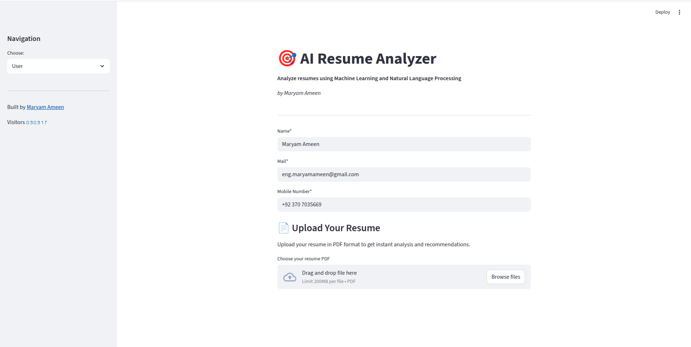
  <br/>
  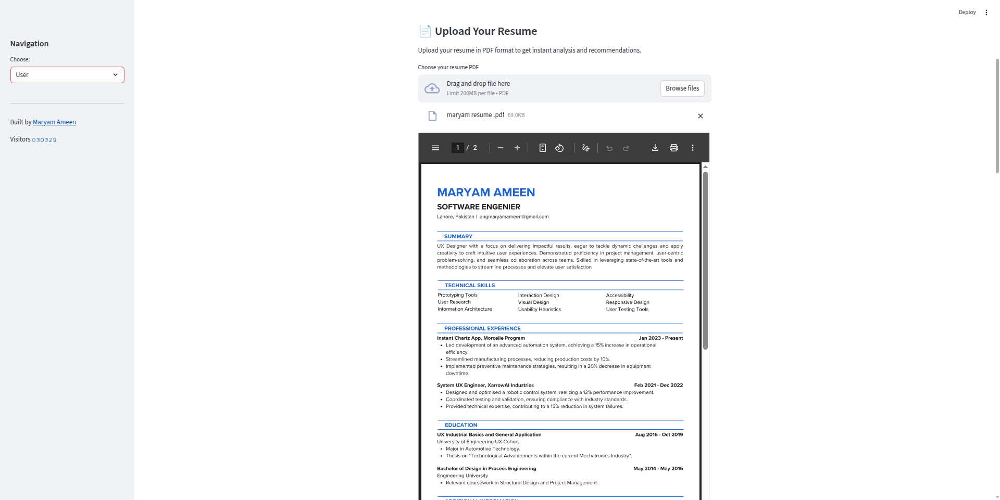
  <br/>
  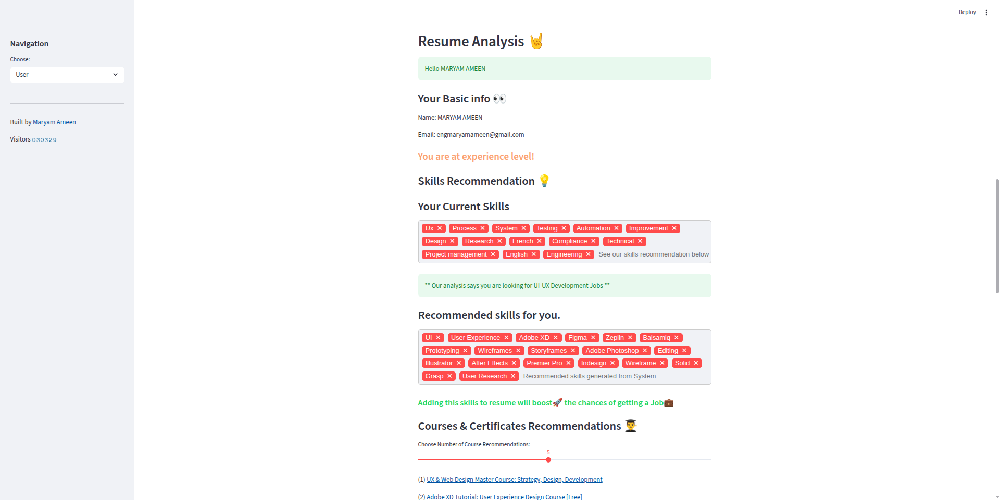
  <br/>
  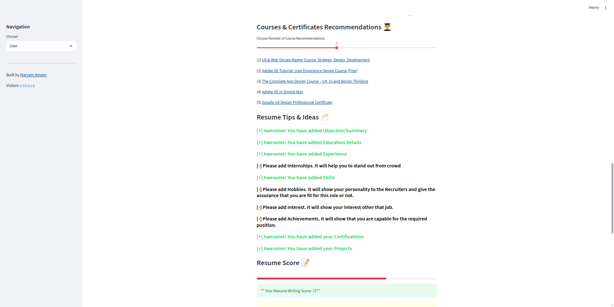
  <br/>
  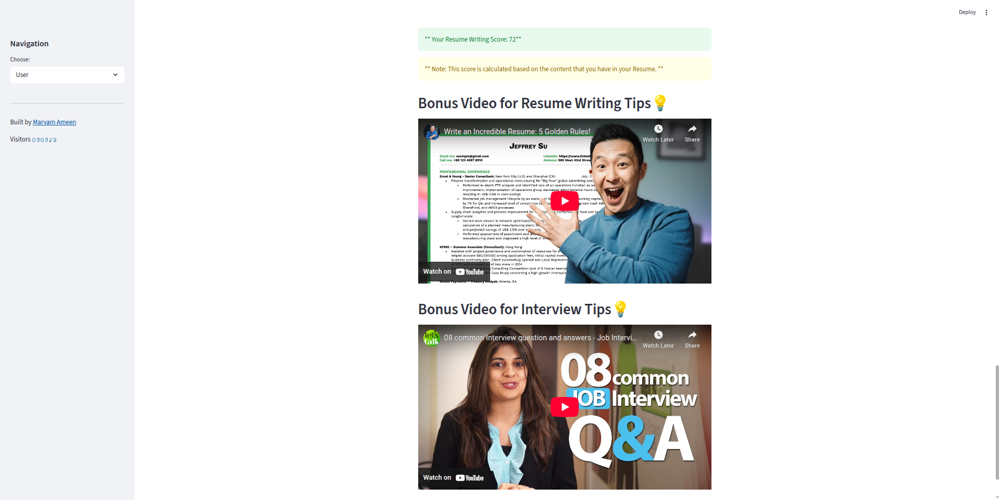
</details>

<details>
  <summary><strong>Feedback</strong></summary>

  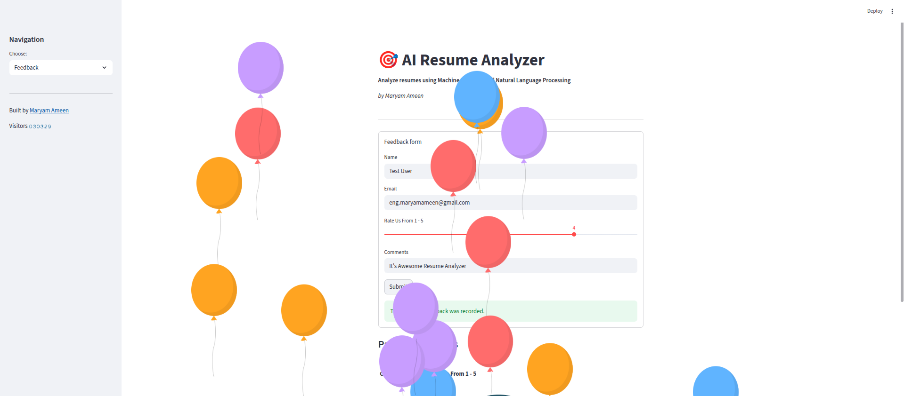
  <br/>
  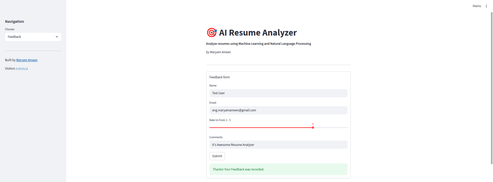
  <br/>
  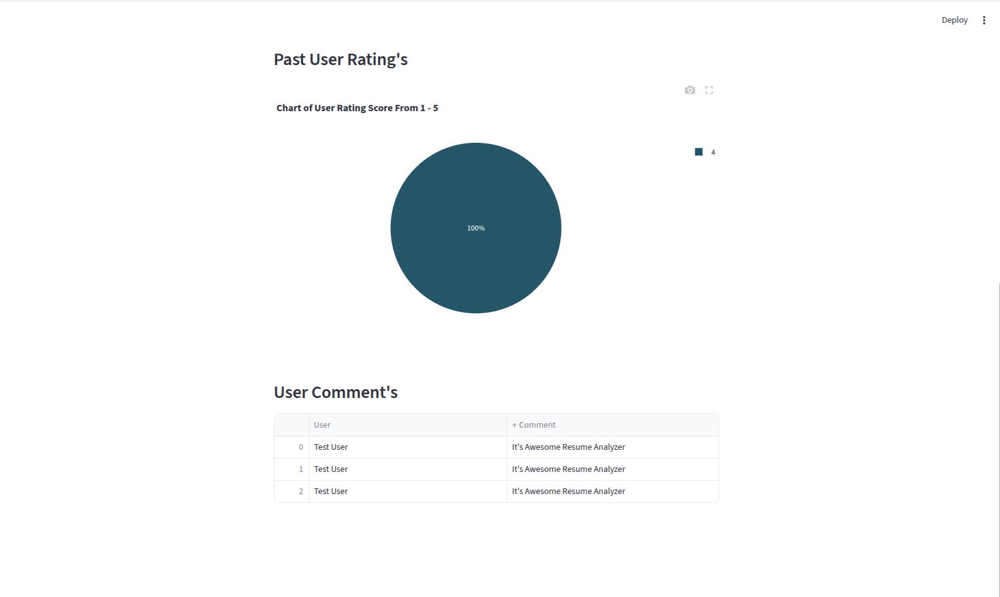
  <br/>
  
  <br/>
  
  <br/>
  
</details>

<details>
  <summary><strong>Admin</strong></summary>

  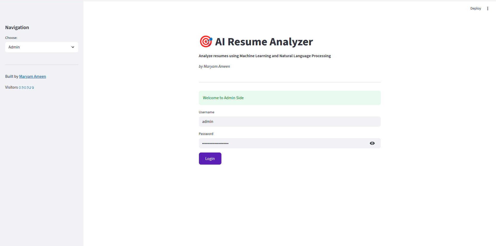
  <br/>
  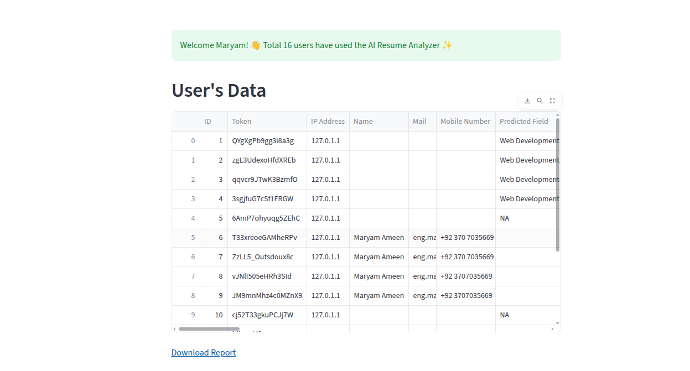
  <br/>
  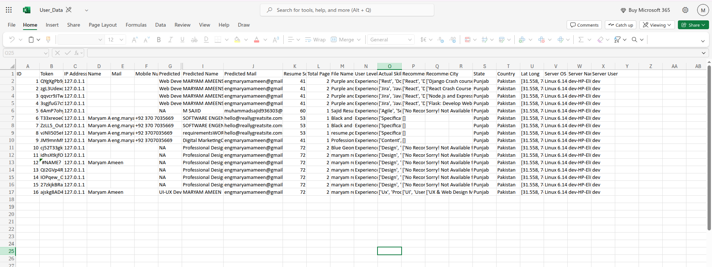
  <br/>
  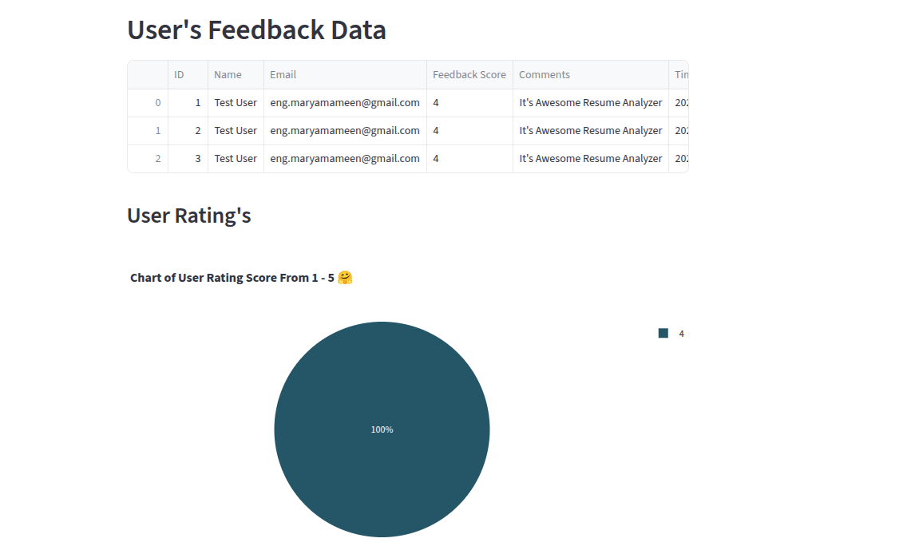
  <br/>
  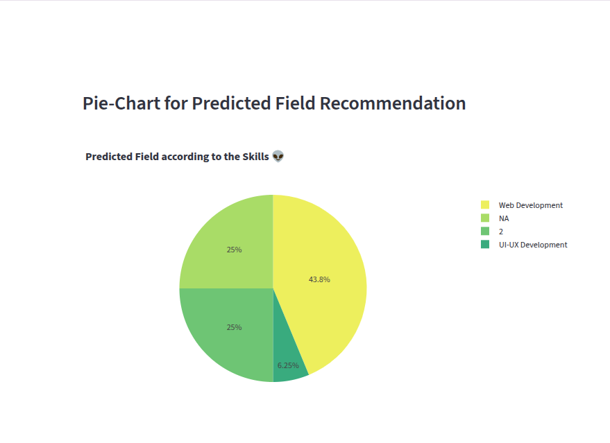
  <br/>
  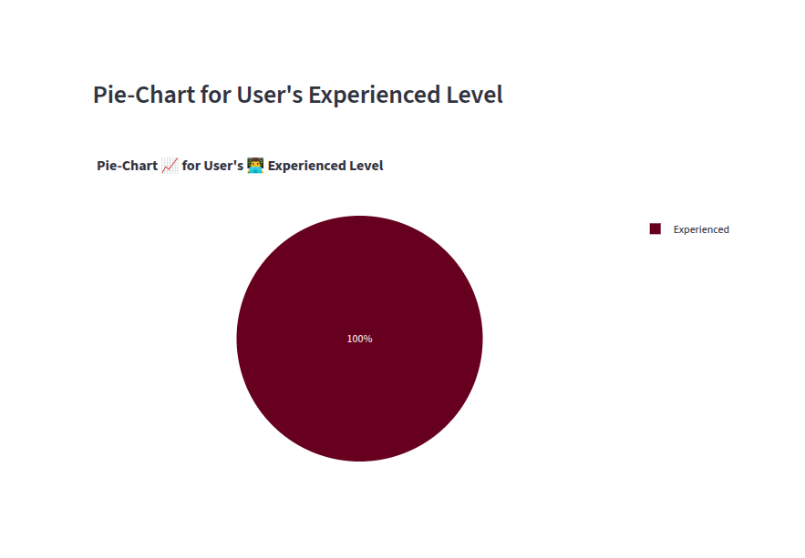
  <br/>
  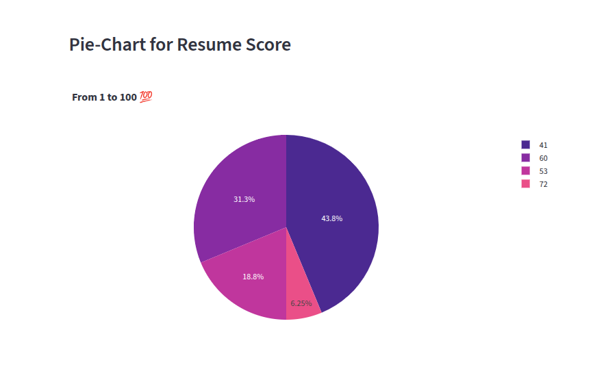
  <br/>
  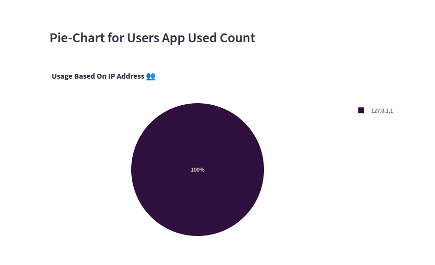
  <br/>
  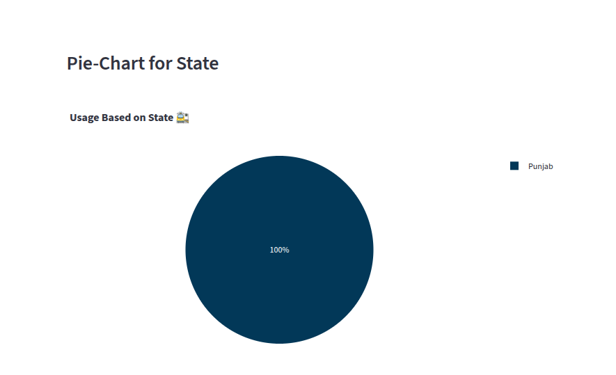
  <br/>
  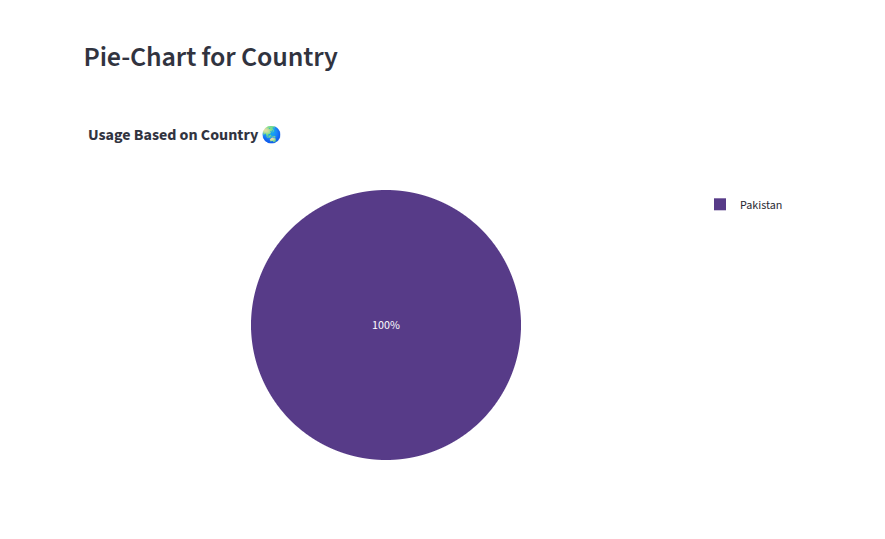
</details>

### Built with 🤍 by <a href="https://www.linkedin.com/in/maryam-ameen">Maryam Ameen</a>

## Sponsors 💖

If this project helps you, please consider supporting it.

<p>
  <a href="https://github.com/sponsors/engmaryamameen"></a>
  &nbsp; 
  <a href="mailto:eng.maryamameen@gmail.com?subject=Sponsor%20AI-Resume-Analyzer&body=Hi%2C%20I%27d%20like%20to%20support%20the%20project."></a>
</p>

---

<p align="center">
  If you find this useful, please ⭐ star and 👀 watch the repository to get updates.
</p>
